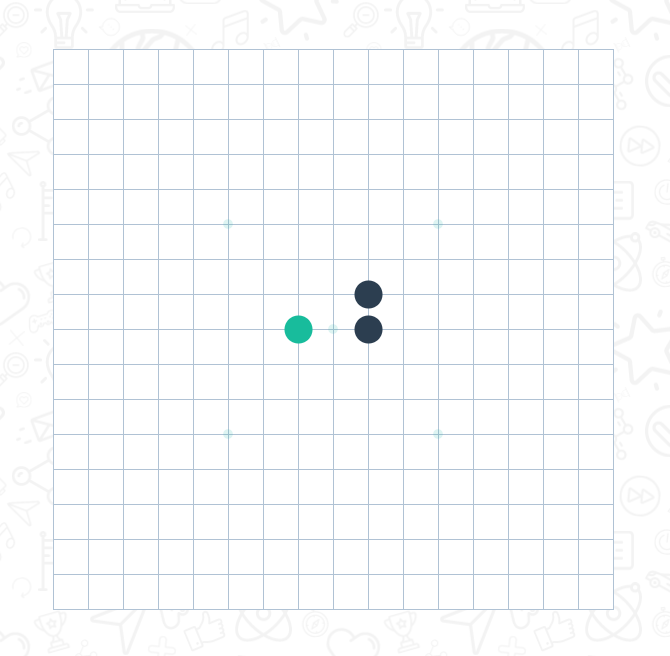

### 功能目标

使用Vue+Vuex实现一个五子棋对战功能

### 实现功能

* 黑子先手，白子后手，不需要使用AI自动落子

* 选择棋盘大小: 允许选择$10\times10$，$15\times15$, $20\times20$大小的棋盘

* 自定义获胜条件：4子连线、5子连线、6子连线

* 记录下棋的时间、获胜方、棋盘布局，在棋局历史中可以查看结束时的棋盘
  
  * 挑战：记录棋局的落子记录，允许在棋盘历史中回看

### 挑战功能

    编写一个五子棋AI，让人类与其对战

